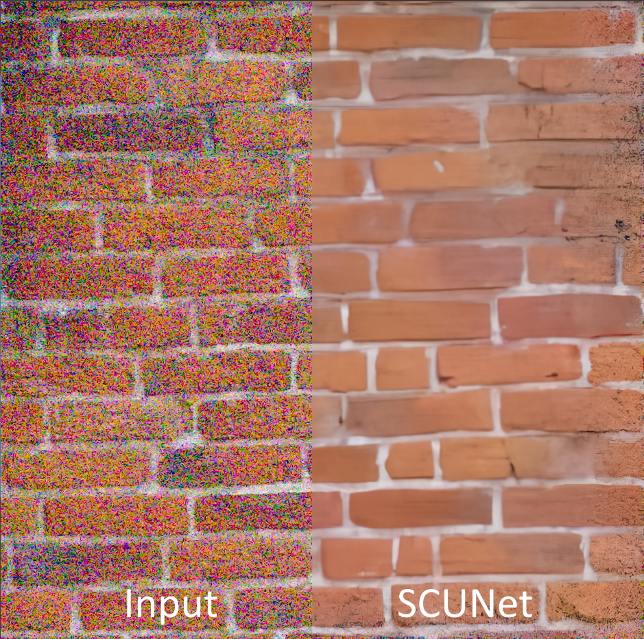

# Denoise

Denoising is the process of removing noise from an image, fixing random variation of brightness or color information in images:

 

The two (extreme) example images are taken from the [Natural Image Noise Dataset](https://commons.wikimedia.org/wiki/Natural_Image_Noise_Dataset) which is an open dataset of photographs with real noise from varying ISO values.

### Details

  Creation Date: 20. Nov 2022  
  Models used: 14  
  Set Name: 'Denoise'  
  Image Files: [Github Repo](https://github.com/Phhofm/upscale/tree/main/assets/images)  

  

    
Models List

    ISO_denoise_v1
    ISO_denoise_v2
    NoiseToner-Poisson-Detailed_108000_G
    NoiseToner-Poisson-Soft-101000_G
    NoiseToner-Uniform-Detailed_100000_G
    NoiseToner-Uniform-Soft_10000_G
    Film-Degrainer-1-000
    LADDIER1_282500_G
    Restormer
    MAXIM
    NAFNet
    Swin-Conv-UNet (SCUNet)
    SwinIR
    Old Photo Restoration via Deep Latent Space Translation

  

## Directions ISOH3

  <iframe allowfullscreen scrolling="no" src="https://imgsli.com/MTM1MjQ2" style="width: 100%; border: 0px none; height: 55vmin; min-height: 310px; margin-top: -75px; margin-bottom:-30px;">
  </iframe>

<a href="https://imgsli.com/MTM1MjQ2" target="_blank">Open in external tab</a>

  
Details

  

  Creation Date: 20. Nov 2022  
  Image Dimensions: 1280x848 pixels  
  Type: Photo  

  

  

  

    
Metadata

  

Camera manufacturer	FUJIFILM  
Camera model	X-T1  
Author	Trougnouf (Benoit Brummer)  
Copyright holder  	
cc-by-sa-4.0  
Exposure time	1/4,400 sec (0.00022727272727273)  
F-number	f/11  
ISO speed rating	6,400  
Date and time of data generation	14:24, 15 December 2018  
Lens focal length	30.2 mm  
Orientation	Normal  
Horizontal resolution	300 dpi  
Vertical resolution	300 dpi  
Software used	darktable 2.5.0+1087~g1078fb85e  
File change date and time	17:18, 15 December 2018  
Y and C positioning	Centered  
Exposure Program	Aperture priority  
Exif version	2.3  
Date and time of digitizing	14:24, 15 December 2018  
Meaning of each component	  
1. Y  
2. Cb  
3. Cr  
4. does not exist  
   
APEX shutter speed	12.169924996926  
APEX aperture	6.8925124792013  
APEX brightness	5.56  
APEX exposure bias	−3  
Maximum land aperture	2.9708536585366 APEX (f/2.8)  
Metering mode	Pattern  
Light source	Unknown  
Supported Flashpix version	1  
Color space	sRGB  
Focal plane X resolution	820  
Focal plane Y resolution	820  
Focal plane resolution unit	3  
Sensing method	One-chip color area sensor  
File source	Digital still camera  
Scene type	A directly photographed image  
Custom image processing	Normal process  
Exposure mode	Auto exposure  
White balance	Auto white balance  
Focal length in 35 mm film	45 mm  
Scene capture type	Standard  
Saturation	Normal  
Sharpness	Normal  
Subject distance range	Unknown  
Image compression mode	2.5  
Flash	Flash did not fire  
Bits per component	  
  1. 16  
  2. 16  
  3. 16  
   
Height	3,250 px  
Width	4,906 px  
Pixel composition	RGB  
Number of components	3  
Rating (out of 5)	1  

  

## Stefantiek ISOH2

  <iframe allowfullscreen scrolling="no" src="https://imgsli.com/MTM1MjQ4" style="width: 100%; border: 0px none; height: 120vmin; min-height: 310px; margin-top: -75px; margin-bottom:-30px;">
  </iframe>

<a href="https://imgsli.com/MTM1MjQ4" target="_blank">Open in external tab</a>

  
Details

  

  Creation Date: 20. Nov 2022  
  Image Dimensions: 543x1024 pixels  
  Type: Photo  

  

  

  

    
Metadata

  

Camera manufacturer	FUJIFILM  
Camera model	X-T1  
Author	Trougnouf (Benoit Brummer)  
Copyright holder	  
cc-by-sa-4.0  
Exposure time	1/1,900 sec (0.00052631578947368)  
F-number	f/9  
ISO speed rating	6,400  
Date and time of data generation	13:52, 15 December 2018  
Lens focal length	55 mm  
Orientation	Normal  
Horizontal resolution	300 dpi  
Vertical resolution	300 dpi  
Software used	darktable 2.5.0+1087~g1078fb85e  
File change date and time	17:17, 15 December 2018  
Y and C positioning	Centered  
Exposure Program	Aperture priority  
Exif version	2.3  
Date and time of digitizing	13:52, 15 December 2018  
Meaning of each component	  
1. Y  
2. Cb  
3. Cr  
4. does not exist  
   
APEX shutter speed	10.960001932274  
APEX aperture	6.307610619469  
APEX brightness	5.16  
APEX exposure bias	−1.67  
Maximum land aperture	2.9708536585366 APEX (f/2.8)  
Metering mode	Pattern  
Light source	Unknown  
Supported Flashpix version	1  
Color space	sRGB  
Focal plane X resolution	820  
Focal plane Y resolution	820  
Focal plane resolution unit	3  
Sensing method	One-chip color area sensor  
File source	Digital still camera  
Scene type	A directly photographed image  
Custom image processing	Normal process  
Exposure mode	Auto exposure  
White balance	Auto white balance  
Focal length in 35 mm film	83 mm  
Scene capture type	Standard  
Saturation	Normal  
Sharpness	Normal  
Subject distance range	Unknown  
Image compression mode	2.5  
Flash	Flash did not fire  
Bits per component	  
1. 16  
2. 16  
3. 16  
   
Height	3,050 px  
Width	1,618 px  
Pixel composition	RGB  
Number of components	3  
Rating (out of 5)	1   

  

