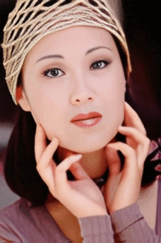

# Face Restoration

Face Restoration Models are meant to restore faces after an upscale because they often come out a little weird. Here I simply use some upscales and then run the face restoration model on them so you can compare which restoration model you like best.

### Details

  Creation Date: 17. Nov 2022  
  Models used: 6  
  Set Name: 'Face Restoration' 
  Image Files: [Github Repo](https://github.com/Phhofm/upscale/tree/main/assets/images)    

  

    
Models List

    GFPGANCleanv1-NoCE-C2
    GFPGANv1.2
    GFPGANv1.3
    GFPGANv1.4
    RestoreFormer
    CodeFormer
  

## Buddy

The input is the buddy example, the SwinIR-L taken from the 'Favorites' page. CodeFormer has been run with fidelity iteration set in 0.1 steps

 
<ImageSliderLocal inputImage='/upscale/sources/facerestoration/buddy/input/SwinIR-L.jpg' localFolder='facerestoration/buddy/output' />
 

  
Details

  

  Creation Date: 17. Nov 2022

  Original Input Image: 480x320 pixels

  Scaling Factor: 4

  Upscale Model: SwinIR-L

  Input Image: 1920x1280 pixels

  Output Image: 1920x1280 pixels

  Type: Photo

  

## Woman

This input is the img_005 from the Set5 dataset, specifically the version here: https://github.com/jbhuang0604/SelfExSR/blob/master/data/Set5/image_SRF_4/img_005_SRF_4_LR.png, upscaled 4x with SwinIR-L.

 
<ImageSliderLocal inputImage='/upscale/sources/facerestoration/woman/input/SwinIR-L.jpg' localFolder='facerestoration/woman/output' />
 

Just to be aware that such an effect might happen, if we go too low with CodeFormers fidelity in this example, the hat gets messed up:

  

  
Details

  

  Creation Date: 17. Nov 2022

  Original Input Image: 57x86 pixels

  Scaling Factor: 4

  Upscale Model: LDSR (100 steps)

  Input Image: 228x344 pixels

  Output Image: 228x344 pixels

  Type: Photo

  

