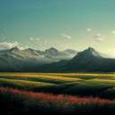
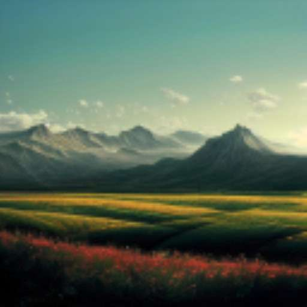
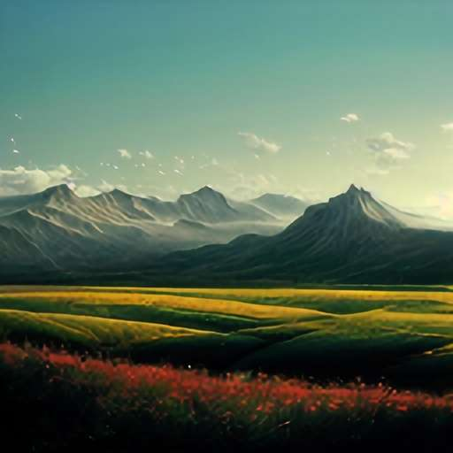
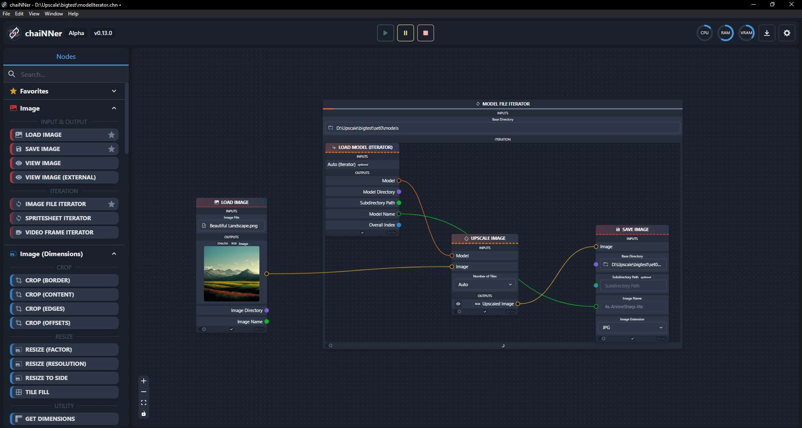

# Introduction

### Super What?

Super Resolution. If we make a small image bigger (upsizing), it starts to look pixelated, simply because there is not enough information present in the small image. To prevent this, we use a method that imagines more details then there are in the original image, to make the image look better when upsizing. This is called upscaling, with the help of super resolution.

To keep things very simple, you can think of it as "AI Image Enlarger" and when you serach on the internet for it you will find lots of websites that will provide such a service. Now think of this website as a place where you can visually compare the results of hundreds of these websites. Just that its not websites we are comparing but individual models.

Let me show you an example of what super resolution does:  
So we start with a small image I generated to depict a beautiful landscape:  

  
Now we can display this image bigger, which is the same as upsizing:
  
But it looks very blurry now, does it not?  
Now instead of upsizing, we make use of super resolution and upscale it:
  
Now this looks better. But these details were not there before, they were artifically generated by the model we used to upscale.

### Models?

Since we cannot generate additional details in an image out of nothing, we make use of neural networks, which have been trained on a specific dataset, so it has the data to generate the additional details in the image we want to upscale.  
These pretrained models is what I have been using on this website to upscale different examples for you. The models I used are listed in the Set Details in the multi models page or then at the very beginning of the page of a single upscaler like SwinIR.

A lot of pretrained models can be found on the [Upscale Wiki Model Database](https://upscale.wiki/wiki/Model_Database)

### Examples
Since beauty is in the eye of the beholder, instead of me telling you whats I like and what not, I included examples on this web page for you to visually compare for yourself.
You can find them in the sub pages on the left side. There is a multi model page where you can select between multiple different models and visually compare them with each other, and the other pages feature examples for one specific upscaling model to compare the original with the upscaled version.

For the comparisons I embedded on this page imgsli examples I had created. You can move the slider to compare, and you can even zoom into the image to better compare the details. The bottom right button enables fullscreen. The comparison works best on a large desktop/laptop screen rather than on a small mobile phone screen.
Here is an example:  

  <image-compare
    :before="before"
    :after="after"
    isDraggable
    isZoomable
    :zoom="zoom"
    @wheel.prevent
    @touchmove.prevent
    @scroll.prevent
  />

The images I use are either photos of mine or then images I had created with Midjourney (or Stable Diffusion).

Head over to the subpages to see more examples, most importantly to the [multiple models page](./multimodels) or if you would like to compare only a small selection, you can head over to the [favorites page](./favorites)

### Applications

To uspscale these images I made use of [chaiNNer](https://github.com/chaiNNer-org/chaiNNer) which is an actively maintained application and the one I recommend. Others would be [IEU](https://github.com/ptrsuder/IEU.Winforms) or [Cupscale](https://github.com/n00mkrad/cupscale) but I have not used them myself.

Additionally I used websites like different spaces on [huggingface](https://huggingface.co/), different models on [replica](https://replicate.com/) and colabs from google colab like this stable diffusion [automatic1111 colab](https://colab.research.google.com/github/TheLastBen/fast-stable-diffusion/blob/main/fast_stable_diffusion_AUTOMATIC1111.ipynb) or [HLKY](https://colab.research.google.com/github/TheLastBen/fast-stable-diffusion/blob/main/fast_stable_diffusion_hlky.ipynb).

Here is a screenshot of using chaiNNer for a specific set on the multi models page:  

### So what model should I use?

The one you personally like best. This page is meant for visual comparison of models not for me to recommend a specific one. But still, as a little help, for some of my favorites I have made specific subpages which only compare the original with the upscaled version. I mean any subpage besides this introduction page and the important multi models page.